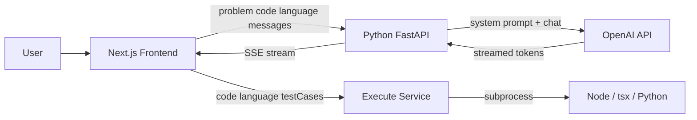

# Code Arena — Project Notes

> Living doc for interview prep and progress tracking. Fill in sections as you build.

---

## One-line pitch

**Code Arena** is a LeetCode-style coding playground with a split architecture: a **Next.js/React frontend** for the editor and problem UI, and a **Python FastAPI backend** that powers an **AI tutoring assistant** via **OpenAI** (streaming hints from live problem context + user code) and a **code execution service** for test-case grading.

Practice saying this in under 20 seconds.

---

## Architecture (draw from memory)



**Be ready to explain:**
- Why **two services** (API key security, separation of concerns)
- Why **streaming/SSE** (better UX than waiting for full response)
- What travels in each request (`messages`, `problem`, `code`, `language`)
- Why **hidden test cases** are not sent to the AI (only public `examples`)

---

## 3-Day Plan — Progress Tracker

### Day 1: Architecture + minimal Python server

| Task | Status | Notes |
|------|--------|-------|
| Map existing props/state (problem, code, language) | ✅ Done | `PlaygroundLayout.tsx` |
| Understand why API key lives in Python, not React | ✅ Done | |
| FastAPI server with `GET /health` | ✅ Done | `backend/app/main.py` |
| CORS for `localhost:3000` | ✅ Done | |
| Run uvicorn on port 8000 | ✅ Done | |

**Day 1 deliverable:** ✅ Complete

---

### Day 2: OpenAI + data contract

| Task | Status | Notes |
|------|--------|-------|
| Pydantic schemas (`ChatRequest`, `Problem`, `Message`) | ✅ Done | `backend/app/schemas.py` |
| Prompt builder (tutor personality) | ✅ Done | `backend/app/services/prompts.py` |
| OpenAI streaming client | ✅ Done | `backend/app/services/openai_client.py` |
| `POST /api/assistant/chat` with SSE | ✅ Done | `backend/app/routes/assistant.py` |
| Test via FastAPI `/docs` without frontend | ⬜ Verify | Do this before interviews |

**Day 2 deliverable:** ✅ Complete (verify `/docs` test once)

---

### Day 3: Frontend integration

| Task | Status | Notes |
|------|--------|-------|
| `AssistantPanel` chat UI + message state | ✅ Done | |
| SSE stream reader in React | ✅ Done | `ReadableStream` + `data:` parsing |
| Pass `language` from `PlaygroundLayout` | ✅ Done | Line 116 |
| `NEXT_PUBLIC_ASSISTANT_API_URL` in `.env.local` | ✅ Done | |
| End-to-end test (hint, review code, switch language) | ⬜ Verify | Run both servers and test |
| Quick-action buttons ("Give me a hint", etc.) | ⬜ Todo | Same pipeline, pre-filled messages |
| Error state when Python server is down | ⬜ Todo | Show user-friendly message in UI |

**Day 3 deliverable:** 🟡 Mostly done — polish remaining

---

### Beyond the 3-day plan (bonus work)

| Task | Status | Notes |
|------|--------|-------|
| Code execution service | 🟡 WIP | `executor.py`, `execute.py` — uncommitted |
| Monaco editor | ✅ Done | |
| FlexLayout IDE-style panels | ✅ Done | |
| Executor tests | 🟡 WIP | `backend/tests/test_executor.py` |
| Problem picker (multiple problems) | ⬜ Todo | Only `problems[0]` loaded |
| C++ / Java execution | ⬜ Todo | Types exist, not wired |

---

## Decision log

| Decision | Options considered | What you chose | Why |
|----------|-------------------|----------------|-----|
| LLM provider | OpenAI, AWS Bedrock, Ollama | OpenAI | Faster to integrate, strong coding models, good docs |
| Backend language | Next.js API route, Python | Python | Separate service, learn backend, clearer AI logic layer |
| Backend framework | Flask, FastAPI | FastAPI | Async, auto OpenAPI docs, Pydantic validation |
| Frontend ↔ backend protocol | REST JSON, WebSockets, SSE | REST + SSE | Simpler than WebSockets; streaming without extra infra |
| Chat SDK | Vercel AI SDK, raw fetch | Raw fetch + SSE | Python backend doesn't match AI SDK protocol |
| Model | gpt-4o, gpt-4o-mini | gpt-4o-mini (default) | Cost vs quality for hints |
| Auth | None, Clerk | Clerk (planned) | User identity for rate limiting later |
| DB | Supabase, none | Supabase (planned) | Chat history, submissions later |
| Code execution | Client-side, backend subprocess | Backend subprocess | Security + consistent judging |

**Interview gold:** "I chose X over Y because…" — not "I followed a tutorial."

---

## Tech stack cheat sheet

| Layer | Tech | Your one-liner |
|-------|------|----------------|
| Frontend | Next.js 16, React 19, TypeScript | App router, client components for interactive playground |
| Layout | flexlayout-react | Resizable/draggable panels like an IDE |
| Editor | Monaco | Code editing with language switching |
| Backend | Python 3.11+, FastAPI, uvicorn | HTTP API + streaming + code execution |
| AI | OpenAI Chat Completions (stream) | Tutor-style hints from problem + code context |
| Execution | subprocess (Node, tsx, Python) | Run user code against test cases |
| Validation | Pydantic (backend), TypeScript types (frontend) | Shared data contract |
| Auth (deps) | Clerk | Ready for per-user limits |
| DB (deps) | Supabase | Ready for persistence |

---

## Data flow — Assistant chat

When user clicks **Send** in the Assistant panel:

1. **Frontend** appends user message to local `messages` state
2. **POST** to `/api/assistant/chat` with: `messages`, `problem`, `code`, `language`
3. **Backend** builds a **system prompt** (tutor rules + problem + code)
4. **OpenAI** returns a **stream** of tokens
5. **Backend** forwards as **SSE** (`data: chunk\n\n`)
6. **Frontend** reads the stream and updates the assistant bubble live

**Practice:** Walk through this without looking at code.

---

## Data flow — Code execution

When user clicks **Run**:

1. **Frontend** sends `code`, `language`, `testCases` to `/api/execute/run`
2. **Backend** writes code to temp file, runs via subprocess (Node/tsx/Python)
3. **Backend** compares stdout to expected output per test case
4. **Frontend** shows verdict in Output panel (`Accepted`, `Wrong Answer`, errors)

---

## Security & production

| Topic | Status | Notes |
|-------|--------|-------|
| API keys | ✅ Done | `OPENAI_API_KEY` only in `backend/.env` |
| CORS | ✅ Dev only | Allow `localhost:3000`; restrict to real domain in prod |
| Prompt safety | ✅ Done | Don't send `testCases`; tutor rules discourage full solutions |
| Rate limiting | ⬜ Planned | Per-user via Clerk JWT |
| Error handling | 🟡 Partial | Console errors; add UI message for backend down |
| Cost control | ⬜ Verify | `gpt-4o-mini`, max tokens cap — check OpenAI dashboard |

One sentence: *"Secrets never touch the client; the browser only knows the backend URL."*

---

## Features matrix (honest status for resume)

| Feature | Status | Notes |
|---------|--------|-------|
| Problem + editor layout | ✅ Done | FlexLayout, starter code per language |
| Monaco code editor | ✅ Done | |
| AI assistant chat | ✅ Done | Python + OpenAI + SSE |
| Streaming responses | ✅ Done | |
| Code run / judge | 🟡 WIP | Executor built, uncommitted |
| Problem picker | ⬜ Todo | 2 problems defined, only first loaded |
| Auth (Clerk) | ⬜ Planned | Dependency only |
| Persistence (Supabase) | ⬜ Planned | Chat history, submissions |
| C++ / Java support | ⬜ Planned | Types + starter code exist |

**Resume rule:** List what works or is demonstrable; say "in progress" for the rest in conversation.

---

## Metrics to track

Fill in as you test:

- **Latency (first token):** ~___ seconds
- **Request size per chat:** ~___ KB
- **OpenAI cost for N test conversations:** ~$___
- **Endpoints:** `GET /health`, `POST /api/assistant/chat`, `POST /api/execute/run`
- **Languages supported (execution):** JS, TS, Python

Example interview line: *"I capped max tokens at 1024 and used gpt-4o-mini so a typical hint costs under a cent."*

---

## Challenges & STAR stories

Template:

> **Problem:** …  
> **Cause:** …  
> **Fix:** …  
> **Learning:** …

### Story 1: CORS blocked frontend → Python
- **Problem:** Browser blocked fetch from `localhost:3000` to `localhost:8000`
- **Cause:** Cross-origin request without CORS headers
- **Fix:** Added FastAPI CORS middleware
- **Learning:** CORS is a browser security rule, not a bug in Python or React

### Story 2: Stream parsing in React
- **Problem:** Assistant response appeared all at once or garbled
- **Cause:** Needed to parse SSE `data:` lines from ReadableStream chunks
- **Fix:** Split chunks by `\n`, extract content after `data: `
- **Learning:** Streaming requires incremental state updates in React

### Story 3: Stale code in AI context
- **Problem:** AI gave hints for old code after user edited
- **Cause:** Code wasn't sent on every request
- **Fix:** Send `code` from parent state on each chat POST
- **Learning:** Context must reflect live editor state

### Story 4: Model recreating & unstable callbacks
- **Problem:** FlexLayout panels re-rendered unnecessarily
- **Cause:** Unstable factory/callback references
- **Fix:** `useCallback`, `memo` on panels (commit `3598f76`)
- **Learning:** Performance matters in IDE-like UIs with many panels

### Story 5: (add your own as you hit new issues)
- **Problem:**
- **Cause:**
- **Fix:**
- **Learning:**

---

## Common interview questions — prep answers

| Question | Angle to hit |
|----------|-------------|
| Why split frontend and backend? | Security, scaling, team boundaries, swap AI provider without touching UI |
| Why FastAPI over Node for this? | Python ecosystem for ML/AI; clear service boundary; Pydantic validation |
| How does streaming work? | OpenAI stream → Python generator → SSE → fetch reader in React |
| What if OpenAI is down? | HTTP error handling, retry message, optional fallback model |
| How do you prevent cheating via AI? | Hints-first prompt, no hidden tests, optional "hint budget" |
| How would you scale this? | Rate limit, queue, cache common hints, deploy backend separately |
| What would you add next? | Commit executor, problem picker, auth, chat persistence |

---

## Resume bullets (pick what's true)

- Built **Code Arena**, a full-stack coding practice app with **Next.js** IDE-style UI and **Python FastAPI** AI assistant using **OpenAI** streaming.
- Designed **REST + SSE** architecture to keep API keys server-side while delivering real-time tutor responses in the browser.
- Implemented **context-aware prompts** from live editor state (problem, language, user code) for guided hints without exposing hidden test cases.
- Used **Pydantic** and **TypeScript** types to align frontend/backend contracts for chat and problem payloads.
- Built a **code execution service** supporting JS/TS/Python with subprocess-based test-case grading.

---

## Weekly tracker

```text
Week of [date]
- Shipped:
- Learned:
- Blocked: ... → fixed by ...
- Demo URL / screenshot:
- Interview story: one problem I solved this week
```

### Week of ___

- Shipped:
- Learned:
- Blocked:
- Demo:
- Interview story:

---

## Demo prep checklist

- [ ] Record a **2-minute screen recording**: open problem → write code → ask assistant → stream reply
- [ ] Keep **both terminals** ready (Next.js + uvicorn)
- [ ] Open **Network tab** once to show POST + streaming response
- [ ] Open **FastAPI /docs** to show auto-generated API schema
- [ ] GitHub README: architecture diagram + setup steps + env vars list
- [ ] Run code execution demo (Run button → test results)

---

## Mental model checklist

After finishing, you should answer:

1. **Why is there a Python backend at all?** → secrets, separation, OpenAI calls
2. **What travels in the HTTP request body?** → messages, problem, code, language
3. **What is the system prompt and who creates it?** → backend, from problem + code + rules
4. **What is SSE and why use it?** → one-way stream, live typing effect
5. **Which file would you change to swap OpenAI for another provider?** → `openai_client.py` only
6. **Why pass `code` on every message?** → user edits code between messages; AI needs latest version

---

## What NOT to overclaim

- Don't say "production-ready" if auth, rate limits, and deployment aren't done
- Don't say "real-time collaboration" unless you built it
- Don't say "custom LLM" if you use OpenAI API
- Do say: *"MVP with clear path to auth, persistence, and full code execution"*

---

## Next steps (priority order)

1. Commit and test code executor (WIP files)
2. Verify end-to-end assistant flow + FastAPI `/docs` test
3. Add quick-action buttons + backend-down error UI in AssistantPanel
4. Problem picker UI (load both problems)
5. Root README with setup instructions
6. Clerk auth + rate limiting
7. Supabase for chat/submission history
